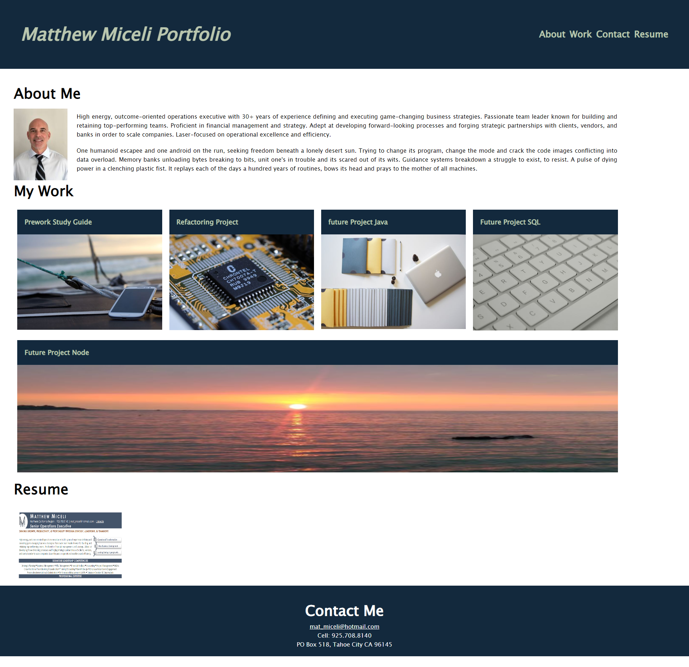

# Advanced CSS: Portfolio

## Description
Portfolio page to showcase progress in coding bootcamp course for future employers

Made use of flexbox properties as well as hovering when moving the curser over text and images that link to external sites or other areas of the website.

I'm sure it's not the most efficient or cleanest coding but I'm happy with my first attempt from scratch. 😊

## Table of Contents
>* Mock-Up
>* Usage
>* Credits
>* License

## Mock-Up
The following image hows the application's appearance and functionality:

.
 
>Link to site: [Matthew's Portfolio](https://matty-bamboo.github.io/homework-challenge-02).

## Usage
N/A
## Credits
>Berkeley-Web-Dev-Spring-Summer-2023 homework-challenge-02 [UCB-Coding-Bootcamp Github](https://ucb.bootcampcontent.com/UCB-Coding-Bootcamp/UCB-VIRT-FSF-PT-03-2023-U-LOLC/-/tree/main/02-Advanced-CSS/02-Homework-Challenge).

## License
Advanced CSS: Portfolio is licensed under the MIT License